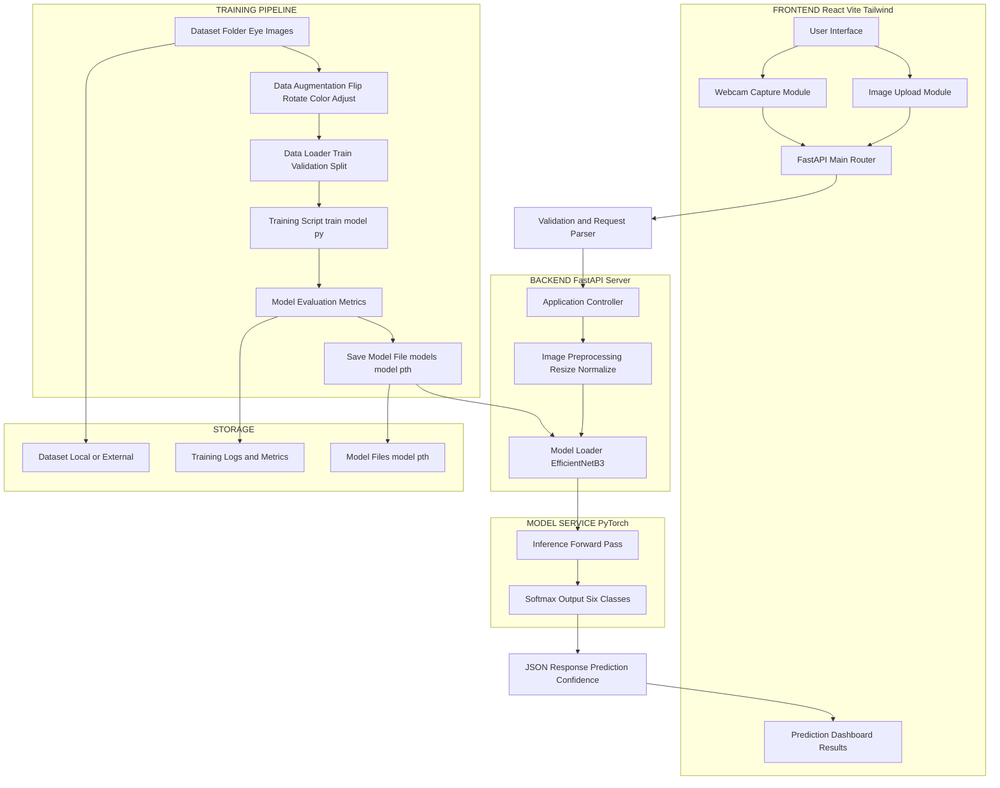

# **OpthalmoAI – AI-Powered Eye Disease Detection**

[]()
[]()
[]()
[]()
[]()

---

## ⭐ **Overview**

**OpthalmoAI** is a **full-stack, AI-powered ophthalmology application** designed to detect **six major eye diseases** using a **state-of-the-art deep learning model (EfficientNetB3)**.  
It features a **responsive React frontend**, **secure FastAPI backend**, and an **optimized TensorFlow inference pipeline** for fast, real-time medical predictions.

---

## 🚀 **Key Features**

- **Deep Learning Model**: EfficientNetB3 trained on high-quality medical datasets  
- **FastAPI Backend**: Secure & efficient inference system  
- **React Frontend**: Clean UI with fast interactions  
- **Real-time Predictions**  
- **Cloud-ready architecture**  
- **Modular & scalable codebase**

---

## 🧠 **Model Architecture**

- Backbone: **EfficientNetB3**
- Input resolution: **300×300**
- Output: **6-class softmax**
- Exported format: **SavedModel / H5**

---

## 🖼️ Detection Categories

The system predicts the following:

1. **Cataract**  
2. **Glaucoma**  
3. **Diabetic Retinopathy**  
4. **AMD (Age-Related Macular Degeneration)**  
5. **Hypertensive Retinopathy**  
6. **Normal Healthy Eye**

---

## Frontend Setup
```bash
cd frontend
npm install
```

---

## ⚡ How to Run

### Step 1 — Dataset & Model
Download dataset → put in `dataset/` → train:
```bash
python scripts/train_model.py
```

Creates:
```
models/model.pth
```

### Step 2 — Start Backend
```bash
python backend/main.py
```

### Step 3 — Start Frontend
```bash
cd frontend
npm run dev
```

---

## 📂 Project Structure
```
backend/  
frontend/  
scripts/  
models/  
dataset/
```

---

## 📊 Architecture Diagram


