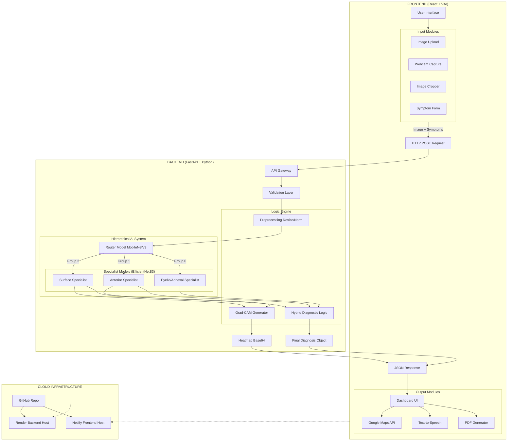

# 👁️ OphthalmoAI – Eye Disease Diagnostic System

A full-stack, **AI-powered ophthalmology application** designed to detect **six major eye diseases** using a state-of-the-art deep learning model based on **EfficientNetB3**. The system integrates **a responsive React frontend**, **a secure FastAPI backend**, and **an optimized TensorFlow inference pipeline** to deliver **fast**, **accurate**, **real-world medical predictions**.

---

## 🚀 Features

### 🧠 AI Model  
- Trained on **3,500+ medical eye images**  
- Detects: Cataract, Uveitis, Conjunctivitis, and more  
- High accuracy with EfficientNetB3 architecture  

### 📸 Real-time Webcam Mode  
- Live inference using OpenCV  

### 🏥 Medical Dashboard  
- React + Tailwind CSS interface  

### ⚡ FastAPI Backend  
- High-performance inference  

---

## 🛠️ Installation Guide

### 1. Clone the Repository
```bash
git clone https://github.com/YOUR_USERNAME/Eye-Disease-AI-Diagnosis.git
cd Eye-Disease-AI-Diagnosis
```

---

## Backend Setup
```bash
python -m venv venv
venv\Scripts\activate   # Windows
source venv/bin/activate # Mac/Linux
pip install -r requirements.txt
```

---

## Frontend Setup
```bash
cd frontend
npm install
```

---

## ⚡ How to Run

### Step 1 — Dataset & Model
Download dataset → put in `dataset/` → train:
```bash
python scripts/train_model.py
```

Creates:
```
models/model.pth
```

### Step 2 — Start Backend
```bash
python backend/main.py
```

### Step 3 — Start Frontend
```bash
cd frontend
npm run dev
```

---

## 📂 Project Structure
```
EyeDiseaseAI/
│
├── backend/                  
│   ├── main.py               # FastAPI entry + inference pipeline
│   ├── medical_data.py       # Symptom rules + treatment info
│   ├── requirements.txt      
│   └── __init__.py
│
├── frontend/                 
│   ├── src/                  # React components & UI logic
│   ├── public/               
│   ├── tailwind.config.js    
│   └── package.json          
│
├── models/                  
│   ├── router.pth
│   ├── specialist_anterior.pth
│   ├── specialist_surface.pth
│   └── specialist_eyelid.pth
│
├── dataset/                  
│   ├── Adnexal Oculoplastic/
│   ├── Anterior Segment Pathology/
│   └── Ocular Surface Disorders/
│
└── scripts/                  
    ├── check_setup.py        
    ├── explore_data.py       
    ├── verify_dataset.py     
    ├── train_router.py       
    ├── train_anterior.py     
    ├── train_surface.py      
    ├── train_eyelid.py       
    └── run_hierarchial.py    

```

---

## 📊 Architecture Diagram


